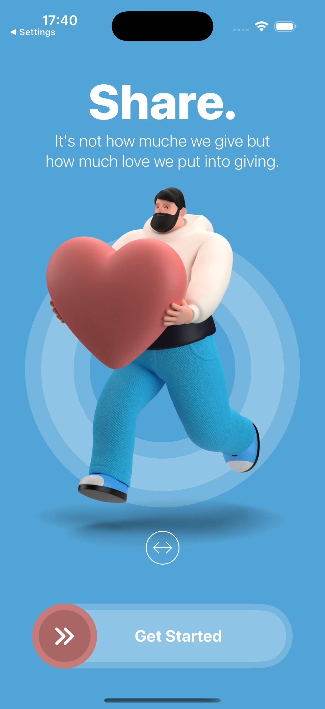
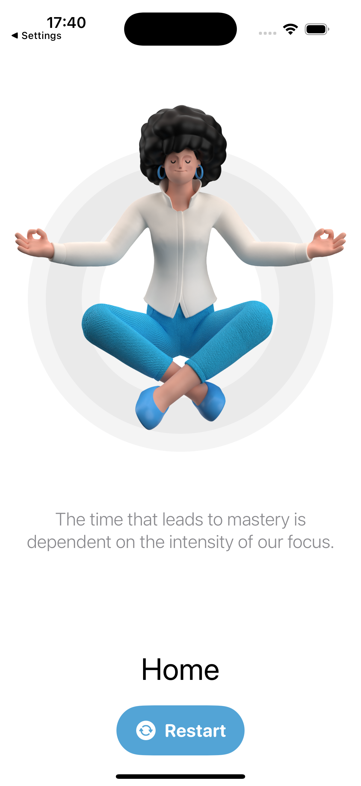
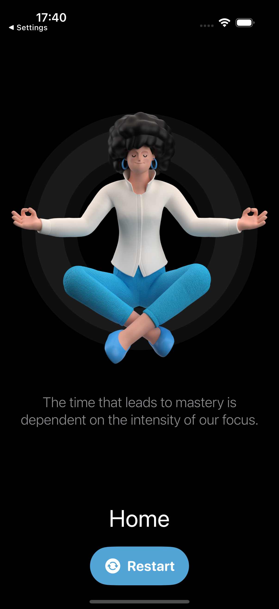

# SwiftUI Restart App

A modern iOS onboarding experience built with SwiftUI, featuring interactive animations, gesture-based interactions, and immersive user feedback mechanisms.

## Overview

**Restart** is a SwiftUI-based onboarding app that demonstrates advanced iOS development techniques. The app showcases smooth animations, intuitive drag gestures, haptic feedback, and audio integration to create a delightful first-time user experience.

## Features

### 🎨 Interactive Onboarding Experience
- **Custom Slide-to-Start Button**: Draggable capsule button with visual feedback
- **Interactive Character Animation**: Drag the character left and right with parallax effects
- **Dynamic Text Transitions**: Text changes from "Share." to "Give." based on user interaction
- **Animated Background**: Beautiful circular gradient animations that react to user input

### 🔊 Sensory Feedback
- **Sound Effects**: Audio feedback on successful interactions using AVFoundation
- **Haptic Feedback**: Tactile responses for success and warning states
- **Visual Animations**: Smooth, easeOut animations throughout the app

### 🎯 Core Functionality
- **Persistent Onboarding State**: Uses `@AppStorage` to remember if the user has completed onboarding
- **Home Screen**: Clean interface with floating character animation
- **Restart Capability**: Users can revisit the onboarding experience anytime

### 🌓 Design Features
- **Dark Mode Optimized**: Beautiful dark-themed color palette
- **Responsive Layout**: Adapts to different screen sizes
- **Custom Colors**: Brand colors (ColorBlue and ColorRed)
- **Reusable Components**: Modular view architecture

## Screenshots

<table>
  <tr>
    <td></td>
    <td></td>
    <td></td>
  </tr>
  <tr>
    <td align="center"><em>Onboarding Screen</em></td>
    <td align="center"><em>Interactive Gesture</em></td>
    <td align="center"><em>Home Screen</em></td>
  </tr>
</table>

## Technical Implementation

### SwiftUI Components

#### OnboardingView (`OnboardingView.swift`)
The main onboarding screen featuring:
- Dynamic title animation with state-based transitions
- Character image with drag gesture recognition (±150pt bounds)
- Rotation effect based on drag distance
- Parallax effect on background circles
- Custom slide-to-unlock button with progress indicator
- Success/warning haptic feedback based on gesture completion

#### HomeView (`HomeView.swift`)
A minimalist home screen with:
- Floating character animation (35pt vertical movement)
- Continuous animation loop using `.repeatForever()`
- Restart button with sound effects
- Inspirational quote display

#### CircleGroupView (`CircleGroupView.swift`)
A reusable animated component that creates:
- Concentric circle patterns
- Customizable color and opacity
- Scale and blur entrance animations
- Used as decorative background element

#### AudioPlayer (`AudioPlayer.swift`)
Sound management utility providing:
- Global audio player instance
- Flexible sound playback function
- Support for multiple audio formats (mp3, m4a)
- Error handling for missing audio files

### Key Technologies

- **SwiftUI**: Declarative UI framework
- **@AppStorage**: UserDefaults wrapper for persistent data
- **@State**: Local view state management
- **DragGesture**: Touch-based interaction handling
- **AVFoundation**: Audio playback functionality
- **UINotificationFeedbackGenerator**: Haptic feedback
- **Animations**: Custom timing curves and transitions

## Requirements

- **iOS**: 14.0+
- **Xcode**: 13.0+
- **Swift**: 5.5+
- **Device**: iPhone (optimized for modern screen sizes)

## Installation

1. Clone the repository:
```bash
git clone https://github.com/yourusername/SwiftUIProject3-Restart.git
cd SwiftUIProject3-Restart
```

2. Open the project in Xcode:
```bash
open SwiftUIProject3-Restart.xcodeproj
```

3. Select your target device or simulator

4. Build and run (⌘R)

## Project Structure

```
SwiftUIProject3-Restart/
├── SwiftUIProject3-Restart/
│   ├── SwiftUIProject3_RestartApp.swift    # App entry point
│   ├── Screen/
│   │   ├── ContentView.swift               # Root view with navigation logic
│   │   ├── OnboardingView.swift            # Onboarding screen
│   │   └── HomeView.swift                  # Home screen
│   ├── Views/
│   │   └── CircleGroupView.swift           # Reusable circle animation component
│   ├── Utilities/
│   │   └── AudioPlayer.swift               # Sound playback utility
│   └── Assets/
│       ├── character-1                     # Onboarding character image
│       ├── character-2                     # Home screen character image
│       ├── chimeup.mp3                     # Success sound
│       └── success.m4a                     # Restart sound
├── SwiftUIProject3-RestartTests/
└── SwiftUIProject3-RestartUITests/
```

## Learning Objectives

This project demonstrates:

1. **Advanced Animations**: Chaining multiple animations with different timing functions
2. **Gesture Recognition**: Implementing and constraining drag gestures
3. **State Management**: Using `@State` and `@AppStorage` effectively
4. **Haptic Feedback**: Enhancing UX with tactile responses
5. **Audio Integration**: Playing sounds in response to user actions
6. **Component Reusability**: Creating modular, reusable SwiftUI views
7. **Responsive Design**: Building layouts that adapt to different screen sizes
8. **Performance**: Efficient state updates and animation handling

## Key Code Patterns

### Drag Gesture Implementation
```swift
.gesture(
    DragGesture()
        .onChanged { gesture in
            if abs(imageOffset.width) <= 150 {
                imageOffset = gesture.translation
            }
        }
        .onEnded { _ in
            imageOffset = .zero
        }
)
```

### Persistent State with AppStorage
```swift
@AppStorage("onboarding") var isOnboardingViewActive: Bool = true
```

### Custom Animation Timing
```swift
.animation(.easeOut(duration: 1), value: isAnimating)
```

## Customization

### Colors
Modify the custom colors in `Assets.xcassets`:
- `ColorBlue`: Primary onboarding background
- `ColorRed`: Accent color for buttons

### Sounds
Replace audio files in the asset catalog:
- `chimeup.mp3`: Onboarding completion sound
- `success.m4a`: Restart button sound

### Text Content
Update the inspirational quotes in:
- `OnboardingView.swift:36-40` (Onboarding quote)
- `HomeView.swift:32-34` (Home screen quote)

## Contributing

Contributions are welcome! Please feel free to submit a Pull Request.

1. Fork the project
2. Create your feature branch (`git checkout -b feature/AmazingFeature`)
3. Commit your changes (`git commit -m 'Add some AmazingFeature'`)
4. Push to the branch (`git push origin feature/AmazingFeature`)
5. Open a Pull Request

## License

This project is available under the MIT License. See the LICENSE file for more info.

## Credits

Created by Yaro Paul - 2024

## Acknowledgments

- Character illustrations and design assets
- Inspiration from modern onboarding patterns
- SwiftUI community for best practices

---

**Note**: This project is part of a SwiftUI learning series focusing on animations, gestures, and user experience design.
